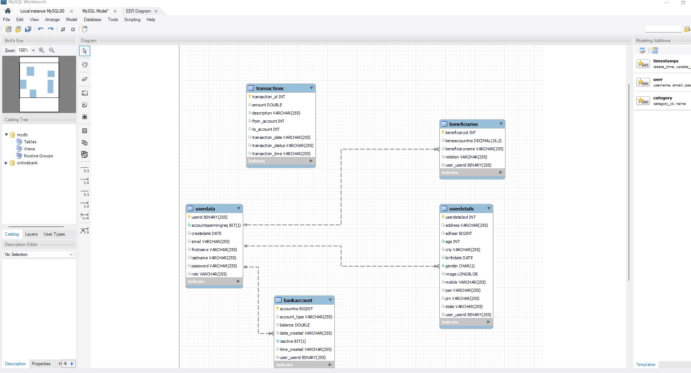

# Online banking System

- The goal of this project is to create an online bank management system for bank customers and administrators to manage customer’s bank accounts. This application can simulate real-world banking activities. It enables bank customers to conduct virtual bank transactions, view bank transactions, manage their accounts, send messages to administrators, and track their expenses.

- The server side is built using SpringBoot technology and JAVA as the primary programming language. All bank data will be stored in the MySQL database and retrieved as needed for display, and client side technologies such as ReactJs, TailwindCSS/BootStrap, HTML, and other technologies such as Docker and required APIs will be used as needed.

- This application will be a web application for the best convenience of the customer. The webpages will be screen-size responsive. To ensure that the application is user-friendly for all customers, it will be tested with various web browsers, mobile devices, and PCs.

## ER Diagram

